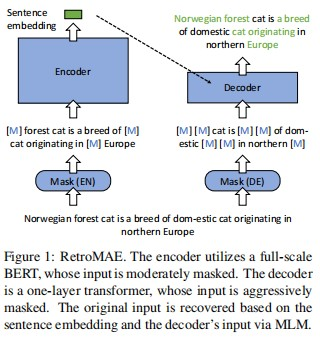
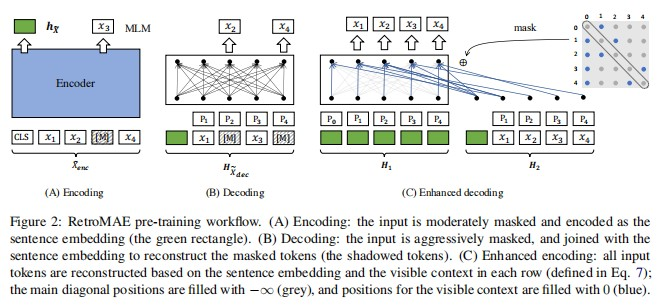

# 相关论文阅读

承接上文 [向量集合-向量库](https://kg-nlp.github.io/Algorithm-Project-Manual/向量表示/向量集合.html)

> 从预训练模型任务上进行优化,训练数据优化,采样和训练策略优化


[TOC]

## 论文目录

| 论文                                                         | 时间 | 阅读 |
| ------------------------------------------------------------ | ---- | ---- |
| [CoSENT（一）：比Sentence-BERT更有效的句向量方案](https://kexue.fm/archives/8847) |      |      |
| [CoSENT（二）：特征式匹配与交互式匹配有多大差距？](https://kexue.fm/archives/8860) |      |      |
| [One Embedder, Any Task: Instruction-Finetuned Text Embeddings](https://github.com/HKUNLP/instructor-embedding) |      |      |
| [SGPT：GPT Sentence Embeddings for Semantic Search](https://github.com/Muennighoff/sgpt) |      |      |
| [RetroMAE](https://github.com/staoxiao/RetroMAE)             |      |      |
| [ngram2vec](https://github.com/zhezhaoa/ngram2vec/)          |      |      |
| [SGNS-skip-gram with negative-sample](https://blog.csdn.net/rosefun96/article/details/108413273) |      |      |
| [RocketQA](https://zhuanlan.zhihu.com/p/267083872)           |      |      |
| [RocketQAv2](https://zhuanlan.zhihu.com/p/424177642)         |      |      |

## 论文概述

### CoSENT（一）：比Sentence-BERT更有效的句向量方案

* 背景
  * 直接优化预测目标cos值,效果不好
  * 训练的数据是句子对,标签是否相似,训练目标是使正样本对的相似度尽可能大,负样本对的相似度尽可能小。但负样本的相似度往往不会那么低，强行将相似度学习为0或-1,通常造成过拟合,或者就学不动;当然沿着这个思路就是将负样本对的阈值变高,但只能缓解,如何选取阈值很难。
  * 作者分析了inferbert和sentence-bert为什么使用上述损失结果也不错的原因
  * 作者提出了新的损失函数，不再追求目标尽量差别的大，而是学习相对的大小（排序），**只要正样本对的相似度大于负样本对的相似度就就可以了**。所以如果样本对间没有相对顺序的话，就不可以用cosent

* CoSENT是有监督的句向量算法，输入数据格式是三元组（原句，相似句，不相似句)
* 基座模型可以自己选

### CoSENT（二）：特征式匹配与交互式匹配有多大差距？


* 作者探究了交互式和特征式能力的理论基础，同时给出了个人理解，对于像PAWSX这样的困难数据集，字面重叠度高但语义不同的负样本，作者认为是“神经网络和cos指标的连续性”与“文本匹配天然存在的对抗性”之间的矛盾造成。
* 神经网络本身就是一个连续函数，然后编码器负责将句子压缩到一个句向量中，其结果的连续性必然是非常好的，这里的连续性，指的是句子的微小改动，导致句向量的改动也是微小的；同时，cos的连续性也非常好，即神经网络输出的相似度变化也小，总的来说就是“特征式”的方案连续性会非常好。但问题是，人设计出来的语言天然存在对抗性，即字面上的微小改动能导致标注结果的巨大变化，经典的就是加个“不”字导致所谓的“语义反转”，说白了就是连续性并不好。
* 当然上面的问题我们也能解决，多学习几轮让模型去拟合，但这样会过拟合。
* 作者还提了一个求解不均衡的分类场景下阈值搜索问题

### One Embedder, Any Task: Instruction-Finetuned Text Embeddings


* 数据

  * 含指令格式的数据

    ```
    Instance = {“query”: [instruction_1, sentence_1],“pos”:[instruction_2, sentence_2],“neg”:[Instruction_2, sentence_3]}
    ```

  * 训练数据

    ```
    [
        {
        'query': ['Represent the Wikipedia question for retrieving relevant documents;', 'big little lies season 2 how many episodes'], 	'pos': ['Represent the Wikipedia document for retrieval;', 'Big Little Lies received Outstanding Limited Series and acting awards for Kidman, Skarsgård, and Dern'], 
        'neg': ['Represent the Wikipedia document for retrieval;', 'Little People, Big World final minutes of the seasonad". A crowd had gathered around Jacob, who was lying on the grou'], 
        'task_name': 'NQ'}
    ]
    ```

  * ​	请求数据

    ```
    from sklearn.metrics.pairwise import cosine_similarity
    sentences_a = [
    	['Represent the Science sentence: ','Parton energy loss in QCD matter'], 
        ['Represent the Financial statement: ','The Federal Reserve on Wednesday raised its benchmark interest rate.']
    ]
    sentences_b = [
    	['Represent the Science sentence: ','The Chiral Phase Transition in Dissipative Dynamics'],
        ['Represent the Financial statement: ','The funds rose less than 0.5 per cent on Friday']
    ]
    embeddings_a = model.encode(sentences_a)
    embeddings_b = model.encode(sentences_b)
    similarities = cosine_similarity(embeddings_a,embeddings_b)
    ```

* 任务

  * 就是添加了很多任务，每种任务数据对中包含了指令
  * 基础模型GTR models 是T5在通用问答数据和检索排序数据上微调的模型
  * 训练方法还是常见的对比学习


### SGPT：GPT Sentence Embeddings for Semantic Search

* 任务
  * 使用GPT输出向量
  * 对于SGPT-CE，在query和document拼接输入模型的时候，加入prompts，然后输出结果对每个token的概率求和并求log对数。对于SGPT-BE，输出多个token，采用带权的求和方法，gpt自回归预测出来越是靠后的token，权重越高，说明越靠后的句子包含的信息越多。在训练的时候使用Gradient Cache技术，并且只微调GPT里面的偏置，其他参数则是固定住。


### RetroMAE

**Masked Auto-Encoder**

* **面向检索的预训练模型**

* 工作流
  * 这个repo包括两个功能:预训练和微调。首先，使用掩码损失函数在通用数据集(或下游数据集)上训练RetroMAE。然后利用对比损失对下游数据集进行微调。为了获得更好的性能，还可以通过蒸馏交互模型来微调RetroMAE。
  
  * 预训练任务不再是传统的MLM，非对称的结构，非对称的掩码率，使用新的自动编码流程，使用增强解码利用query和context重新构造注意力机制，重建query，最终的目标函数是编码器损失和解码器损失之和
  
    



* 模型在零样本密集检索以及有监督的密集检索性能都有所提升。


### ngram2vec

* 介绍
  * 传统的用于word representation的word embedding方法，主要是基于词级别的共现，以word2vec为例，训练样本为<*word* , *word*>，即只考虑了两个词之间的共现情景，作者将Ngram引入到各种词向量的表征方法中，在word2vec，Glove， PPMI，SVD中进行了测试
  * 关于N怎么选取
    * 更大的 n:  对下一个词出现的约束信息更多，具有更大的辨别力；(更准)
    * 更小的 n:  在训练语料库中出现的次数更多，具有更可靠的统计信息，具有更高的可靠性。
    * 理论上，n 越大越好，但在经验上看，trigram 用的最多，尽管如此，原则上，能用 bigram 解决，绝不使用 trigram。


### RocketQA 

* 基于文心预训练模型

* 背景
  * 传统开放域问答采用级联方式,包括段落检索,排序,答案定位等步骤,rocketqa想实现端到端问答
* 问题
  * 采用批次内负采样(in-batch negatives)方式训练,理论上batchsize越大越好,但训练时受到显存大小限制,这就导致和实际上线应用时计算的样本数不一样.
  * 训练数据几百万条,每个问题的答案往往不能全部标注出来,举个例子,某领域公司不同年份年报,有些内容是重复的,这就容易漏标(这个怎么解决?)
  * 人工标注的数据量少,成本高
* 百度解决方案
  * 跨批次负采样,去噪强负例采样,数据增强
  * 跨批次负采样
    * GPU并行训练,则将其它GPU批次内的全部段落都当做当前问题的负样本,直接复用各个GPU已经计算好的段落表示,不用重复计算,还有就是通信和内存开销百度自己的算子实现.候选段落(负样本)随GPU个数线性增加
  * 去噪的强负例采样
    * 适当在训练数据中增加强负例
    * 从排序的段落中采样负例,不能只选排在前面的,可能有漏标情况.使用交互模型进行打分,对于给出高分的的负例不去选择(对候选样本根据负例分值排序,再使用交互模型计算分值,分数高的不选--自己理解的一种实现方式)
  * 数据增强
    * 交互模型对对偶模型检索的候选段落打分,根据置信度选正负样本

​				

### RocketQAv2

* 背景

  * 联合训练召回-精排模型

* 问题

  * 稠密检索模型和精排模型的训练方式不同，通常检索模型采用批次内负采样（in-batch negative sampling）的方式进行训练，而精排模型采用基于pointwise或pairwise的训练方式。由于训练方式不同，二者的训练数据构造方式不同、输入形式不同、产出打分的分布不同，所以无法直接进行联合训练。

* 方式设计

  * 统一的listwise

* 目标构造

  * 动态listwise蒸馏（dynamic listwise distillation）同时更新检索模型和精排模型的参数,并且通过动态蒸馏的形式传递两个模型的信息

  * 使用检索模型和精排模型对query和passage分别打分,正则化得到query和passage的分布

  * 检索和精排两个分布通过KL散度进行优化,尽可能减少两个分布的差异

  * 对精排模型进行优化,采用交叉熵

  * 损失函数为KL散度+交叉熵

* 数据构造

  * 使用RocketQA的检索和精排模型

  * 使用检索模型从语料库召回数据(我们认为已有query和标记正例的passage,只缺少负例),负样本需要设计采样策略
    * 非去噪样本:随机采样N-1

    * 去噪样本:使用精排模型对召回的数据打分,打分最高且大于阈值的passage作为去噪正样本,往后取n-1个小于阈值的文档作为去噪负样本

  * 融合上面的构造的数据到原数据中

* vs RocketQA

  * 沿用RocketQA网络结构和训练技巧,做了上述的改进


## 常用概念

> [各向异性](https://www.zhihu.com/question/460991118)
>
> 各向异性的缺点:最后学到的向量都挤在一起，彼此之间计算[余弦相似度](https://www.zhihu.com/search?q=余弦相似度&search_source=Entity&hybrid_search_source=Entity&hybrid_search_extra={"sourceType"%3A"answer"%2C"sourceId"%3A2353153090})都很高，并不是一个很好的表示。**一个好的向量表示应该同时满足Alignment 和 uniformity，前者表示相似的向量距离应该相近，后者就表示向量在空间上应该尽量均匀，最好是各向同性的。**
>
> 消除各项异性的方法:BERT-flow的工作就是将原来的分布校准为**高斯分布**。标准的高斯分布就是各向同性的;类似的还有**whitening**操作。大概流程就是根据SVD分解的结果，旋转缩放后得到一个标准正态分布;消除主成分;正则化


> Spearman系数
>
> [相关性统计分析](https://kg-nlp.github.io/Algorithm-Project-Manual/数据分析/相关性统计分析.html)
>
> 只依赖于预测结果相对顺序的指标，不依赖于阈值，比较适合检索场景的评测


* [相关论文阅读](https://kg-nlp.github.io/Algorithm-Project-Manual/向量表示/相关论文阅读.html)

* [个人知乎](https://www.zhihu.com/people/zhangyj-n)


